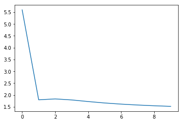

# pytorch-Radical-CNN-RNN
A pytorch implementation of Radical-level Ideograph Encoder for RNN-based Sentiment Analysis of Chinese and Japanese
## Requirement
* numpy
* pytorch >=0.4
* jaconv(https://github.com/ikegami-yukino/jaconv)
* janome(http://mocobeta.github.io/janome/)
## Usage
See Radicals-CNN-RNN_Demo.ipynb

## About the Character Information Database
We used CHISE: http://www.chise.org/ids/
## Reference
```
@article{ke2018cnn,
  title={CNN-encoded radical-level representation for Japanese processing},
  author={Ke, Yuanzhi and Hagiwara, Masafumi},
  journal={Transactions of the Japanese Society for Artificial Intelligence},
  volume={33},
  number={4},
  pages={D--I23},
  year={2018},
  publisher={The Japanese Society for Artificial Intelligence}
}
```
```
@inproceedings{DBLP:conf/acml/KeH17,
  author    = {Yuanzhi Ke and
               Masafumi Hagiwara},
  title     = {Radical-level Ideograph Encoder for RNN-based Sentiment Analysis of
               Chinese and Japanese},
  booktitle = {Proceedings of The 9th Asian Conference on Machine Learning, {ACML}
               2017, Seoul, Korea, November 15-17, 2017.},
  pages     = {561--573},
  year      = {2017},
  crossref  = {DBLP:conf/acml/2017},
  url       = {http://proceedings.mlr.press/v77/ke17a.html},
  timestamp = {Fri, 16 Feb 2018 14:07:29 +0100},
  biburl    = {https://dblp.org/rec/bib/conf/acml/KeH17},
  bibsource = {dblp computer science bibliography, https://dblp.org}
}
```
